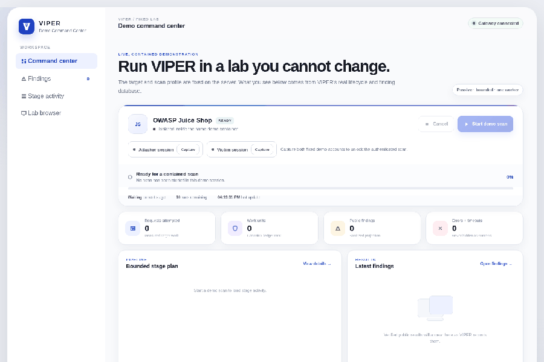
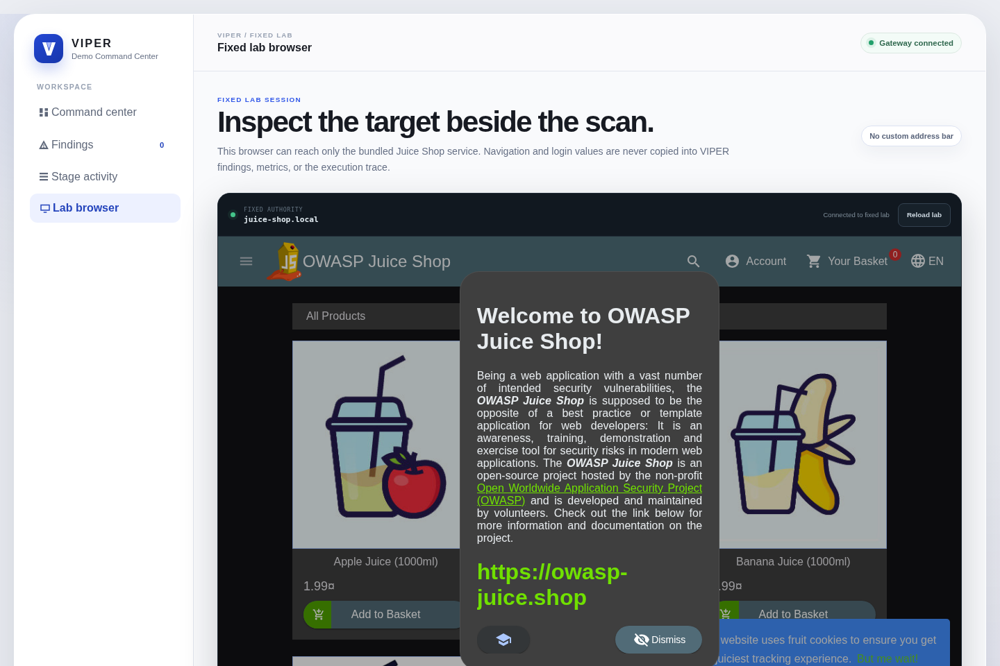
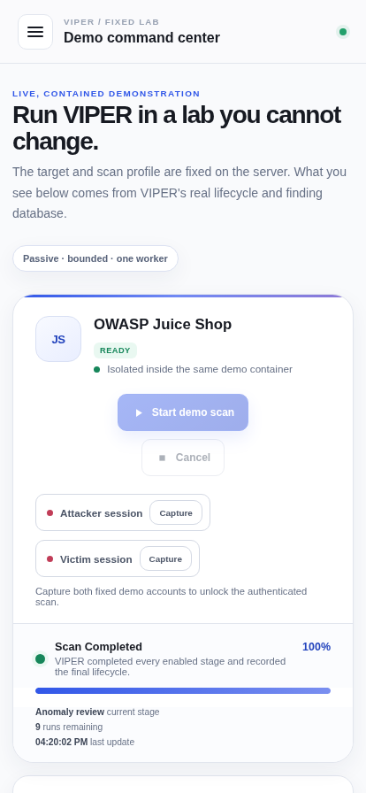
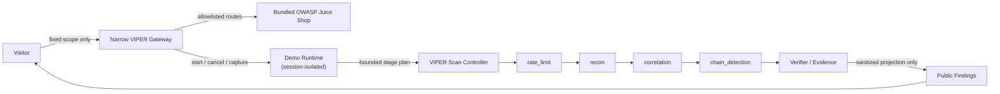

# VIPER
### Cybersecurity Analyst — built for OpenAI Build Week

**Faster application-security work without trading away evidence, privacy, or control.**

<a href="{{VIPER_DEMO_URL}}"><strong>▶ Try the fixed-lab demo</strong></a>
&nbsp;·&nbsp;
<a href="#how-viper-works">Architecture</a>
&nbsp;·&nbsp;
<a href="#the-viper-standard">Engineering standard</a>
&nbsp;·&nbsp;
<a href="#gallery">Gallery</a>

 

  

 

## Why I built it

Security researchers have more tools than ever, but important findings still get lost in noise and disconnected output. I started VIPER to make the work faster without making it careless: understand the application, follow the workflow, keep evidence attached to the correct operation, and say *unknown* when the proof is not there.

That problem is becoming more urgent as companies build faster with AI. Orca Security's 2026 research across more than 1,200 production organizations reports that [81% of organizations running AI packages had at least one known vulnerability, while 99.9% of alerts with an available fix remained unpatched](https://orca.security/resources/blog/2026-state-of-ai-security-report-summary/).

## What VIPER does

VIPER brings discovery, workflow analysis, bounded testing, evidence, and reporting into one control plane. Instead of treating an application as a pile of unrelated URLs, it models observed operations and the relationships between them.

| | |
|---|---|
| 🔒 **Fixed scope, verified first** | Authorization is checked before any target work begins. |
| 🎭 **Real attacker/victim sessions** | The demo captures two distinct authenticated identities server-side — not a fake toggle. |
| 🧵 **Evidence stays attached** | Temporary values stay bound to the correct user, operation, occurrence, and request location. |
| 🛑 **Fails closed** | Cancellation, privacy, and verifier uncertainty all fail closed by default. |
| 🪟 **Narrow public projection** | Public output is a sanitized, allowlisted contract — never raw scanner state. |
| 📊 **Honest metrics** | Metrics describe work that actually happened; skipped or failed work is never counted as success. |

## Try it without receiving the private scanner

The public demo runs against one bundled OWASP Juice Shop instance, inside its own contained gateway.

- A real embedded browser lets you inspect the target lab directly — signup, login, browsing all work against the real application.
- Explicit **Capture Attacker Session** / **Capture Victim Session** controls perform real server-side authentication before the scan unlocks — no one-click theater.
- Multiple visitors are session-isolated: your captured identities are yours alone, and if someone else's scan is running you get a live, honest "in progress" status instead of a confusing error.
- There is no custom target field, credential upload, arbitrary proxy, production API, or access to private scanner logs.

## Gallery

<table>
<tr>
<td width="50%"></td>
<td width="50%"></td>
</tr>
<tr>
<td align="center">Command center — completed scan, live metrics, sanitized execution trace</td>
<td align="center">Fixed lab browser — the real target, no arbitrary navigation</td>
</tr>
</table>

  
   Fully responsive — same live state, phone or desktop

## How VIPER works

The Build Week work focused on the foundation beneath this flow: a canonical operation contract, real session capture, and per-visitor isolation between workflow steps. Codex and GPT-5.6 helped trace callers, challenge assumptions, write adversarial regressions, capture real network traffic to diagnose broken routes, and review analogous consumers. Important changes still had to pass focused, adjacent, static, container, and browser checks before shipping.

VIPER does **not** currently ship AI inside the scanner. AI assisted development during Build Week; privacy-safe product assistance remains future work.

## The VIPER Standard

**Proof before confidence. Quality before coverage. Strong foundations before more features.**

I would rather harden an existing pipeline until it is dependable than add ten checks that create noise, lose context, or cannot be verified. A gate with 1,635 passing tests and three failures is still a failure. The product is supposed to produce results people can trust, so its development follows the same rule.

## What comes next

The next steps are easier installation, deeper workflow understanding, team controls, audit history, safer secret handling, and enterprise deployment. Longer term, I want to add AI assistance that respects privacy and can be measured against the same evidence standard as the rest of VIPER.

VIPER is a long-term project. I believe it can become a dependable cybersecurity analyst for both security teams and companies that are moving too quickly to leave security until later.

---

Only test systems you own or are explicitly authorized to assess. The public demo is intentionally locked to its bundled training lab.
  

