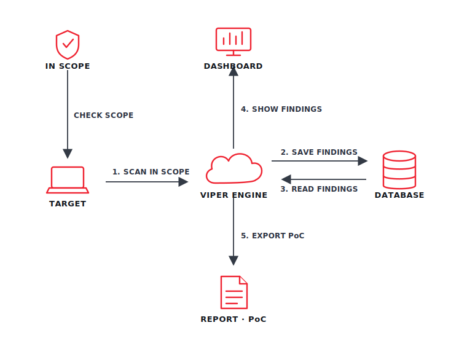
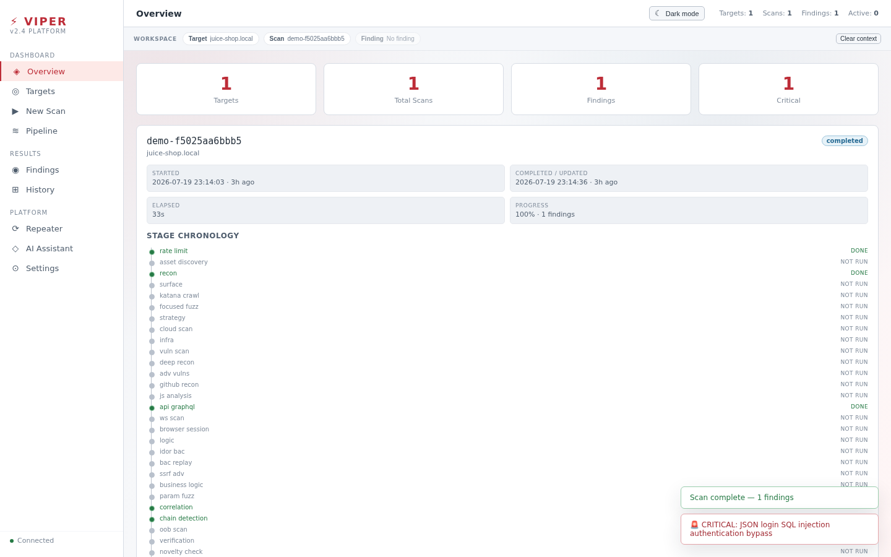
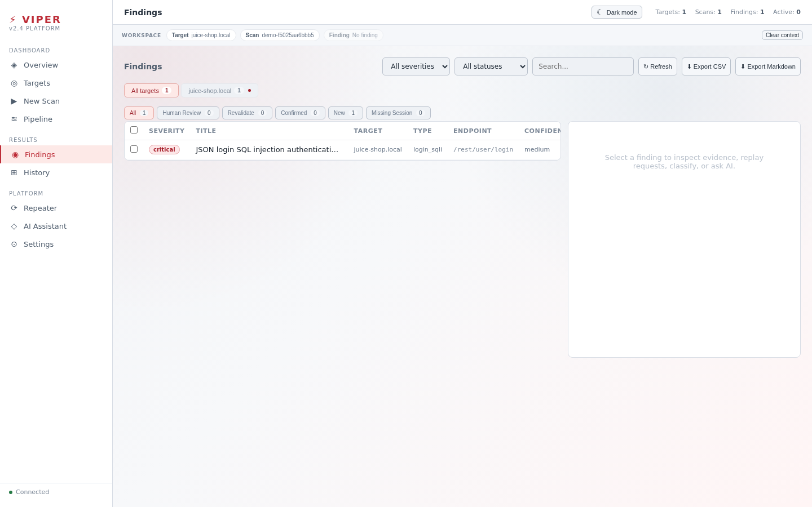

<div align="center">
  
</div>

<h1 align="center">VIPER</h1>
<p align="center"><strong>A bounded, evidence-first control plane for application-security research — submitted to OpenAI Build Week 2026.</strong></p>

<p align="center">
VIPER models an application as observed operations and the relationships between them, instead of a pile of unrelated URLs. Fixed scope is checked before any target work begins, evidence stays attached to the exact request that produced it, and the public dashboard only ever sees a sanitized, allowlisted projection — never raw scanner state.
</p>

<p align="center">
  
  
  
  
  
</p>

<p align="center">
  <a href="https://viper-buildweek-waker.supergogo500.workers.dev"><strong>Try the live demo »</strong></a>
</p>

## Table of contents

- [Overview](#overview)
- [Demo walkthrough](#demo-walkthrough)
- [Try it yourself](#try-it-yourself)
- [The VIPER Standard](#the-viper-standard)
- [What's next](#whats-next)

## Overview

The following diagram shows how a request stays bounded from authorization through to the public dashboard:

<p align="center">
  
</p>

Codex and GPT-5.6 were used as a real engineering partner on the Build Week slice of this work: tracing callers, capturing real network traffic to diagnose broken routes, writing adversarial regressions, and reviewing consumers before anything shipped. VIPER does not ship AI inside the scanner itself — that stays future work.

## Demo walkthrough

The public demo runs against one bundled, disposable OWASP Juice Shop instance behind a narrow gateway. There is no custom target field, credential upload, arbitrary proxy, or access to private scanner logs — only what's shown below.

**1. Capture two real, separate identities.** The dashboard registers fixed attacker and victim accounts on boot. Clicking **Capture Attacker Session** / **Capture Victim Session** performs a real server-side login for each — not a toggle.

**2. Run the bounded scan.** Once both sessions are captured, **Start demo scan** unlocks and VIPER runs its fixed, passive stage plan against the lab.

<p align="center">
  
</p>

**3. Inspect the real finding.** VIPER's actual dashboard — the same one used locally, not a stripped-down imitation — surfaces the exact endpoint, request type, and confidence for what it found.

<p align="center">
  
</p>

Every visitor gets their own isolated session — your captured identities are yours alone, and if someone else's scan is already running you get a live, honest "in progress" status instead of a confusing error.

## Try it yourself

```bash
docker build --file demo/Dockerfile --tag viper-demo .
docker run -p 7860:7860 viper-demo
# → http://127.0.0.1:7860
```

Or just use the [live hosted demo](https://viper-buildweek-waker.supergogo500.workers.dev) — no install, no signup.

## The VIPER Standard

**Proof before confidence. Quality before coverage. Strong foundations before more features.**

I would rather harden an existing pipeline until it is dependable than add ten checks that create noise, lose context, or cannot be verified. A gate with 1,635 passing tests and three failures is still a failure. The product is supposed to produce results people can trust, so its development follows the same rule.

## What's next

Easier installation, deeper workflow understanding, team controls, audit history, safer secret handling, and enterprise deployment — and eventually, AI assistance inside the product itself, held to the same evidence standard as everything else.

---

<p align="center"><sub>Only test systems you own or are explicitly authorized to assess. The public demo is intentionally locked to its bundled training lab.</sub></p>
